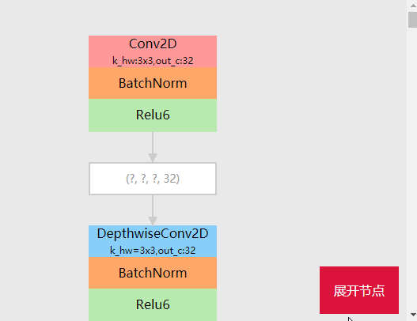
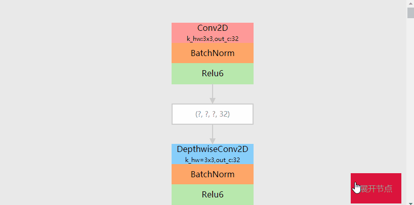

# CNNGraph
## 1 CNNGraph作用
CNNGraph能根据传入的Tensorflow模型文件，自动提取网络结构，并绘制出来。
## 2 使用
### 2.1 pb模型
以MobileNet V1w为例，假设pb模型文件名为mobilenet_v1_1.0_192_frozen.pb，则使用命令如下
```
python read_graph.py  mobilenet_v1_1.0_192_frozen.pb input:0 MobilenetV1/Predictions/Reshape_1:0 dst.html
```

### 2.2 ckpt模型
以MobileNet V1w为例，假设ckpt模型文件名为/mobilenet_v1_1.0_192.ckpt，则使用命令如下
```
python read_graph.py  mobilenet_v1_1.0_192.ckpt batch:0 MobilenetV1/Predictions/Reshape_1:0 dst.html
```
## 3 效果展示
MobileNet V1 网络结构解析并展示效果


